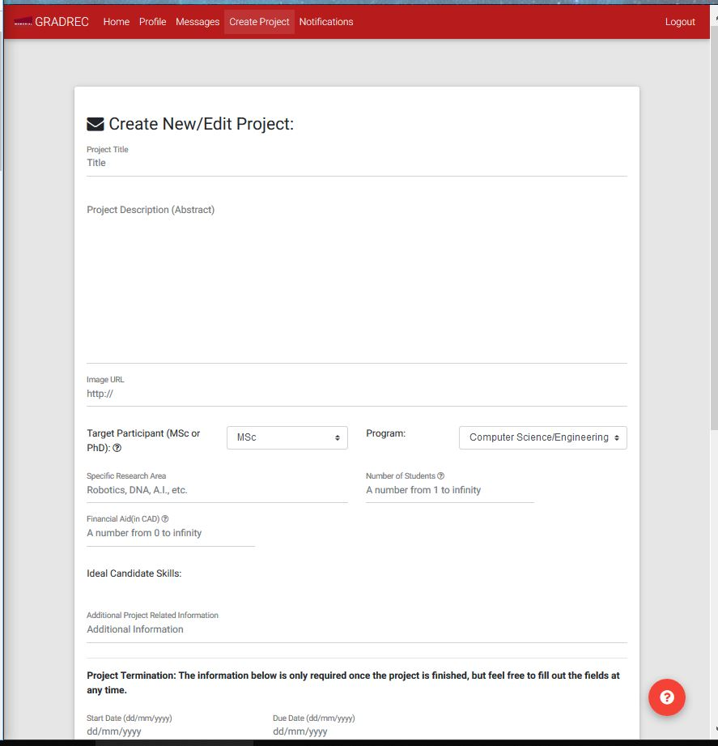

# Create Project

This page is only available to project managers, as only they are allowed to created, edit, or delete projects. To access this page, a project manager may: 1) select the "Create Project" option available in the nav-bar, allowing him/her to create a new project, or 2) from their dashboard, next to any project they own, they will see an "Edit Project" option, that will also take them to the page displayed in the image at the end of this document. 

To go back to the index [click here](https://github.com/rubencg195/GRADREC)

The available fields to fill out are as follows:

1. Title
2. Abstract
3. Image URL: Since the system does not allow users to upload pictures, we do allow users to submit a link containing an image related to the project.
4. Target Participant: Allows the Project Manager to select students for a MSc, PhD, or both
5. Program: This is basically the faculty under which the project is being created
6. Specific Research Area: The idea is to specify, within the program, what type of research is being done. For example, a project under a biology program, could have DNA Splicing as an option here. 
7. Number of students: The number of student participants the project manager needs for his project.
8. Financial AID: The amount, in CAD, available for the entire project. If unknown, or if the project manager wishes to express this amount in a per semester basis, it is recommend that he/she do so under the "Additional Project Related Information" comment section later on in the page.
9. Ideal Candidate Skills: Based on "7. Number of Students", the project manager may select the specific skills he/she is searching for in a per student basis. 
10. Additional Project Related Information: This field is reserved for any comment that our questionaire doesn't cover, or for any information the project manager may wish to communicate, or document, about the project. 

### Project Termination
The information below is only required once the project is finished, but we do allow project manager's to fill out any of the fields at any time, even at the creation of the project.

11. Start Date
12. Due DAte
13. Conclusion
14. Results: We differ conclusion from results, in the sense that results are equivalent to the physical data gathered, while the conclusion would be the logical deduction gathered from that data.
15. Special Thanks: Since only the project manager, and the students, are stored in the system, this section is available for the project to mention other important participants, to thank investors, or as the section says, simply to give thanks. 
16. Participants: This option is not completely editable by the Project Manager, as participants are automatically added after they have been accepted by the project manager. However, once a participant has been accepted, they are displayed in this section. If a participant is displayed here, the project manager has the option to delete the participant, or to view more information about the participant.
16. Is the project finished: This option sends the project to the archives. We do not recommend selecting this option, as the project will become inaccessible by the project manager, or any of its participants afterwards. As the project is archived, it will be stored in the data base, and only the system administrator will be able to see the project. If needed, the system administrator can revert this change, and make the project available to be edited again at any time. 

### Sample Image - Create Project
 

To go back to the index [click here](https://github.com/rubencg195/GRADREC)
